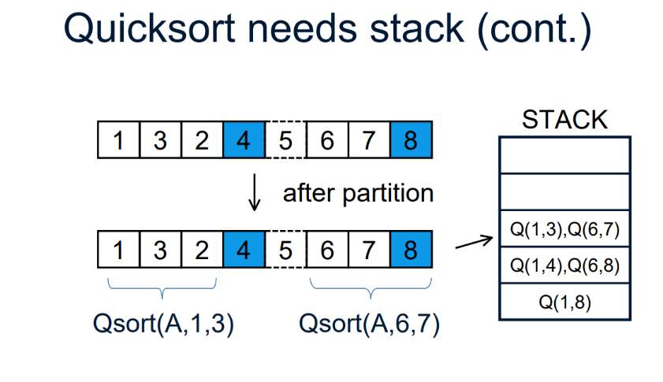

### 第七章 快速排序

#### 快排基本描述

##### 快排基本思路

快排使用了分治思想

与归并排序类似，但又不同

归并是将当前数组分为前后两半，排序好前后两半然后合并成新的有序数组

快排则不同，以下是快排的分治过程

1.**分解**

​	将数组 A[p...r] 划分为 A[p...q-1] 和 A[q+1...r] ，并满足 A[p...q-1] 中所有元素都小于等于A[q] ， A[q+1...r] 中所有元素都大于等于 A[q] 

2.**解决**

​	通过递归，排序两个子数组

3.**合并**

​	其实不需要合并，子数组在原址上已经排序好了

##### 伪代码

```
QUICKSORT(A, p, r)
	if p < r
		q = PARTITION(A, p, r)
		QUICKSORT(A, p, q-1)
		QUICKSORT(A, q+1, r)
```

```
PARTITION(A, p, r)
	x = A[r]
	i = p-1
	for j=p to r-1  
		if (A[j] <= x)
			i+=1
			swap(A[i], A[j])
	swap(A[i+1], A[r])
	return i+1
```

PARTITION的3-6行的 for 循环不断迭代的过程中，把比 x 小的数往前放，最后遍历结束后，所有小于等于 x 的数都被放到了数组A的前面，然后 i 为这些小于等于 x 的数中最右边的那个数的下标


##### 快排的循环不变量

在PARTITION函数运行的过程中，传入的A数组被划分为4个可能为空的取余，每个区域都有各自的性质，这些性质称为快排的**循环不变量**，以下是选择A[r]为主元的循环不变量

1.若 k ∈ [p, i]，则A[k]<=x

2.若 k ∈ [i+1, j-1]，则A[k]>x

3.若 k ∈ [j, r)，此时A[k]与x大小关系未知

4.若 k = r，则A[k] = x


#### 快排的时间复杂度分析

快排复杂度是O(nlgn)，是O而不是Θ，正是因为快排存在着很多种可能的情况，在最坏情况下，复杂度可以达到Θ(n^2^)

因为快排是在不断递归先解决子数组的过程，所以可以画出一个递归树

而情况的好坏，主要取决于划分的两个子数组的比例


**最坏的划分**

如果元素数量为 n 的数组，总是被划分为数量分别为 n-1 和 0 的子数组，那么就是最坏情况的划分

此时T(n) = T(n-1) + Θ(n)

递归树有n层，每层代价为Θ(n)

所以总的复杂度是Θ(n^2^)


按照刚刚上方的伪代码，可能的情况有

1.已排好序的数组

2.全部元素都相等的数组

3.欢迎补充


**最好的划分**

如果元素数量为 n 的数组，总是被几乎平均地划分为两个子数组，此时就是最好情况的划分

T(n) = 2 * T(n/2) + Θ(n)

用主定理方法可以算出 T(n) = Θ(nlgn)


当然，并不是只有接近平均地划分子数组，才能使快排的算法复杂度是O(nlgn)，只要是按照常数比例地划分，复杂度都为O(nlgn)。因为递归每层的代价都为 cn ，而不同的比例主要是递归层数的不同，但用对数计算器算一下可以发现递归层数 差的是常数倍，其实也就是书上所讲的，任何一种**常数**比例的划分都会产生深度为 Θ(lgn) 的递归树


**一般情况**

实际上，由于每次调用PARTITION选取的 x 值都是 A[r] ，而在大多数情况来说 A[r]  并不总是这个子数组中很接近最大/最小的数，所以递归树中的每层所划分的子数组的比例也不会固定

所以好坏情况交替出现的时候，复杂度仍是O(nlgn)，可以根据P99页的图7-5比较容易地证明


#### 快排的优化

**随机选取 x**

在刚刚的快排伪代码中，每次选择 x 的值，我们都是选择 A[r] ，也就是数组的最后一个元素，但进一步划分子数组又与 x 的选取有关，所以为了让算法更加随机化，采取随机抽样的方法， x 的选取不再是数组的最后一个元素，而数组中随机选取一个数(随机生成index，满足 index ∈[p, r] )，然后交换A[index] 与 A[r]


**三点中值优化**

在数组的首元素，末元素，和 中间元素 中(也可以是数组中随机选取三个数)选择大小位于中间的元素，将其选为 x ，并交换至  A[r] 处


**三路基数快排**

在分割算法中进行了改进，将子数组分为了三片区域

|------------------------------|------------------------------|------------------------------|

|------小于 x 的部分------|------等于 x 的部分------|------大于 x 的部分------|

⬆									  ⬆				                       ⬆                                      ⬆

p1									p2									 p3								   p4

如此划分之后，再递归调用QUICKSORT函数的时候，减少了子数组的长度

```
QUICKSORT(A, p1, p2)
QUICKSORT(A, p3, p4)
```


其实这也是课后思考题 7-2 所提及的内容


**C++ sort() 函数中的一些小优化**

1.三点中值优化和类似三路快排的处理方式

2.为减少递归调用次数，当数组长度小于 16 的时候改用 插入排序

3.当递归调用次数过多时，改用堆排序

**4.**使用尾递归优化，减少了递归的深度。

在比较新的编译器中，如果编译器识别出了当前的递归是一个尾递归，那么它就会自动将其优化为迭代，不会像普通的递归一样去使用新的栈空间(并且如果递归链太长会导致程序出现错误)，优化为迭代后，除了保留原本区分子数组的边界，其他的基本上都是在原基础上进行类似覆盖的操作，对当前栈空间进行重用

先给出两个例子来直观地感受一下普通递归和尾递归的区别(以斐波那契数列为例)

普通递归

```python
def fbnq (int x):
    if x == 1:
        return x
    else:
        return x*fbnq(x-1)
```

比如调用fbnq(5)它的递归过程是这样的

```
fbnq(5)
5 * fbnq(4)
5 * 4 * fbnq(3)
5 * 4 * 3 * fbnq(2)
5 * 4 * 3 * 2 * fbnq(1)
5 * 4 * 3 * 2 * 1
5 * 4 * 3 * 2
5 * 4 * 6
5 * 24
120
```

而如果对其进行尾递归优化

```python
def FBNQ(int x, int total):
    if x == 1:
        return total
    else:
        return FBNQ(x-1, total*x);
```

优化过后的递归过程是这样的

```
FBNQ(5, 1)
FBNQ(4, 5)
FBNQ(3, 20)
FBNQ(2, 60)
FBNQ(1, 120)
120
```

程序运行到FBNQ(1, 120)后，返回了 120 这个值， 之后程序不会回溯了，并且其实程序是通过迭代实现的，新的递归调用只是覆盖了当前使用的栈空间


思考题 7-4 给出的伪代码

```
TAIL-RECURSIVE-QUICKSORT(A, p, r)
while p < r
	q = PARTITION(A, p, r)
	TAIL-RECURSIVE-QUICKSORT(A, p, q-1)
	p = q+1
```

进一步结合尾递归优化: 尾递归+取小数组，也就是课后思考题 7-4 c 的答案

```
MODIFIED-TAIL-RECURSIVE-QUICKSORT(A, p, r)
while p < r
	q = PARTITION(A, p, r)
	if q < (r-p)/2
		MODIFIED-TAIL-RECURSIVE-QUICKSORT(A, p, q-1)
		p = q+1
	else
		MODIFIED-TAIL-RECURSIVE-QUICKSORT(A, q+1, r)
		r = q-1
```


然后就贴上sort小部分的源码，此处就运用了尾递归优化

```C++
template <class RandomAccessIterator, class T, class Size>
void __introsort_loop(RandomAccessIterator first,
                      RandomAccessIterator last, T*,
                      Size depth_limit) 
{
    while (last - first > __stl_threshold) 
    {
        if (depth_limit == 0)
        {
            partial_sort(first, last, last);
            return;
        }
        --depth_limit;
        RandomAccessIterator cut = __unguarded_partition
          (first, last, T(__median(*first, *(first + (last - first)/2),
                                   *(last - 1))));
        __introsort_loop(cut, last, value_type(first), depth_limit);
        last = cut;
    }
}
```


贴上张图，此图展示了未优化前栈的使用情况



5.sort() 函数限制了最大的递归次数，如果超过了这个次数，就会调用堆排序


#### 快排章节的课后比较好的思考题

7-2 和 7-4