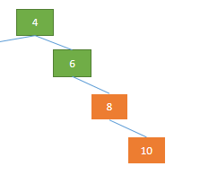
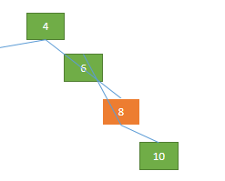
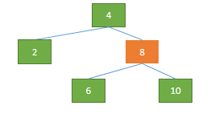
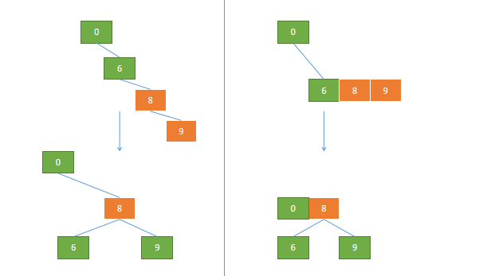
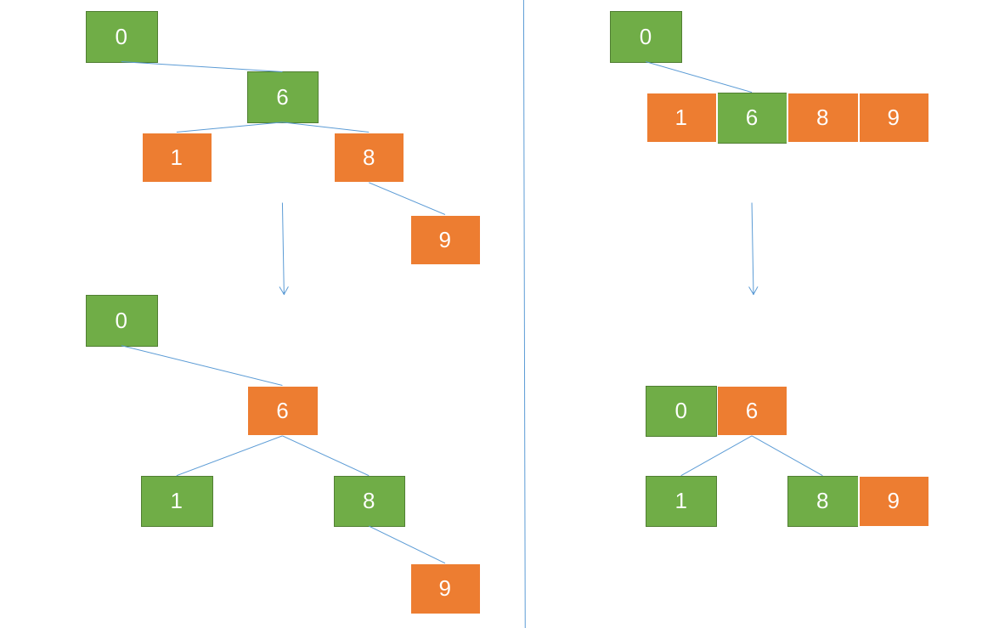

# 红黑树

强烈建议去看pdf或ppt辅助理解插入操作

###   Part 1：2-3-4树 

BST：在随机插入时效果很好，树是比较均匀的，但当数据有序插入时，会退化成链表，时间复杂度的优势消失  

2-3树：效率不太高，但顺序插入时能**自平衡**，解决了BST的缺点  

**特点：**  

1. 一个节点最多有四个子节点    

2. 最多三个节点"相连"    

3. 操作：上溢   

**插入实例：**

见"2-3-4树插入.pdf"

*注：此处以2-3-4树为例，2-3树有相似的原理，也能实现相似的效果(可参考61b和算法4)*


### Part 2 红黑树 

#### 特点

1. 每个节点要么红要么黑
2. 根节点永远为黑
3. 叶节点为黑
4. 不会有两个相连的红节点
5. 对每个节点，从该节点到其所有后代叶节点的简单路径上，均包含相同数目的黑丝节点  
6. 每一棵红黑树都对应着一棵2-3-4树(或2-3树)

*注：
叶节点因不储存值，通常不重要；在所有的演示图中叶节点都会被忽略
可以使用一个哨兵(sentinel)节点代所有的叶节点*

**练习1：**

判断下列树是否为红黑树：  

  

#### 操作与2-3-4树的对应关系

1. 左旋(右旋)

   指针变化：   
     
   2-3-4树的模样：  
     
   
   图示+伪代码：  
   
   
   ```python
   #左旋函数
   def LEFT_ROTATE(T,father):
   
      #定义临时变量（方便理解）
      left_child = father.leftchild
      right_child = father.rightchild
      grandfather = father.father
   
      #指针变化
      #Connect grandfather and right_child 
      grandfather.rightchild = right_child
      right_child.father = grandfather
   
      #Connect right_child's leftchild and father 
      if rightchild.leftchild != T.nil:
         father.rightchild = right_child.leftchild
         right_child.leftchild.father = father.rightchild
   
      #Connect right_child and father
      right_child.leftchild = father
      father.father = right_child
   
      #综合判定
      if right_child.father == T.nil:
         T.root = right_child
   ```
   *注：右旋的操作是镜像的*  


2. 变色

   2-3-4树的模样：  
     

   图示+伪代码：  
   

   ```python
   #改变颜色
   def CHANGE_COLOR(father,uncle,grandfather):
      grandfather.color = red
      father.color = black
      uncle.color = black
   
   ```

3. 搜索(基本同BST)

#### 插入

实例：详见"红黑树插入.pdf"

伪代码：  
   ```python

   #已定义：树T、被插入节点z(key已被赋值)
   #x,y是两个辅助指针
   def RB_INSERT(T,z):
      x = T.root
      y =T.nil 

      #一直访问到目标节点（插入到目标节点的子节点）
      #最后目标节点为y
      while x != Nil:
         y = x

         if z.key < x.key:
            x = x.left
         else:
            x = x.right
   
      #z的父节点设为y
      z.father = y

      #z插入到
      if y == T.nil:
         T.root = z
      else if z.key < y.key:
         y.left = z
      else:
         y.right = z
   
      #设置节点z
      z.left = T.nil
      z.right = T.nil
      z.color = red

      #维护红黑树
      RB-INSERT-FIXUP(T,z)
   ```
   连续两个红节点相连时需要维护  
   维护有三种情况：  
   1. 叔叔节点为红色  
      \>>>变色
   2. 叔叔节点为黑色 && 父节点和子节点均为其父的右(或左)节点  
      \>>>左旋(右旋)
   3. 叔叔节点为黑色 && 父节点和子节点的方向相异，即父右子左(or父左子右)  
      \>>>先右旋再左旋(或相反操作)


   ```python
   def RB_INSERT_FIXUP(T,z):
      while z.father == red:
         if z.father == z.father.father.right:
         #case:father is the leftchild
            uncle = z.father.father.left
            #情况1:
            if uncle.color == red:
               CHANGE_COLOR(z.father,uncle,z.father.father)
               z = z.father.father 
               #reach the next red node
               
            #情况3:
            else:
               if z == z.father.left:
                  z = z.father
                  RIGHT-ROTATE(T,z)
            #把情况3转化为情况2
            
            #情况2:
           	z.father.color = black
               z.father.father.color = red
               LEFT-ROTATE(z.father)
         
         else:
            ...   #与上文相反
      T.root.color = black
   ```
举例见: "FIX-UP.pdf"

#### 删除*
红黑树的删除操作   
##### 对于非叶节点，转换为其前驱(或后继)节点的删除

即**转化为对最后两行中节点的删除**  

(大中最小的/小中最大的)  

*注：之后都描述删除前驱节点的内容*  
举例：  删除"8"  
  

转化为删除: 前驱节点(12)/后继节点(10)  
  

若转化为删除前驱节点，则将8与12两个节点的**值**互换  
  

然后删除节点"8"


##### 删除最后两行的节点，分情况讨论

情况1：  
被删除的节点是红色节点（如上例）  
   \>>>直接删除  

情况2：  
被删除的节点是黑色节点，且有左子节点  
   \>>>左子节点的值与该节点的值互换，删除其左子节点  
例：  
   
   
   

情况3：
删除节点为根节点
   \>>>直接删除

情况4：   
被删除的节点是黑色节点，无子节点，兄弟节点为黑色  

   情况4-1：兄弟节点有红色子节点   
   \>>>借用兄弟节点修复   
   \>>>删除节点   
   \>>>旋转  
   \>>>染色   
例： 


   情况4-2：兄弟节点无红色子节点   
   \>>>父节点向下合并(2-3-4树的说法)  
   \>>>删除节点  
   \>>>染色  
  
  
  

情况5： 
被删除的节点是黑色节点，无子节点，兄弟节点为红色  
   \>>>父节点分裂，向下合并
   \>>>删除节点  
   \>>>旋转
   \>>>染色

### 左倾红黑树 *

参考阅读:  
Algorithms 4th Edition
参考视频:  
[《算法》作者的讲解](https://www.bilibili.com/video/BV14z4y1U7uQ/?p=43)
