# 算法导论第2、3章

# 第二章

**2.1 插入排序**  

伪代码

```
{
for j=2 to A.length，
  key=A[j],
  i=j-1,
  while i>0 and A[i]>key,
    A[i+1]=A[i],
    i=i-1,
  A[i+1]=key,
}
```

>循环不变性

在插入排序中:
每次迭代开始时，子数组A[1,j-1]由原来在A[1,j-1]中的元素组成，
但是已按序排好列了。

其中需证三条性质：

  1.初始化 ：循环的第一次迭代前，它为真

  2.保持 ：如果循环的某次迭代之前它为真，那么下次迭代之前它仍为真

  3.终止：与归纳法不同，归纳法中的归纳步是无限地使用，但是在循环终止时，程序停止“归纳”


>拷贝

先看看下面两段代码，并判断**a.weight和y** 分别是多少？

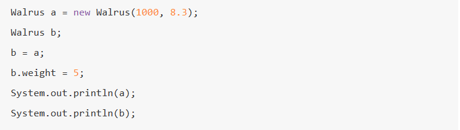

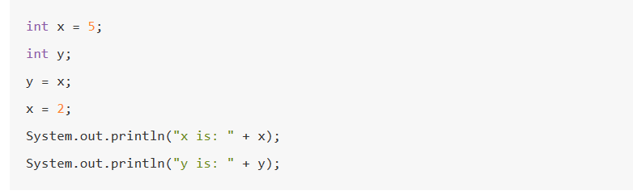


第一张图片中，可知a.weight=5

第二张图片中，可知 y is 5 (为什么不是2呢？)

来观察下列图片
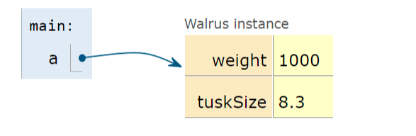
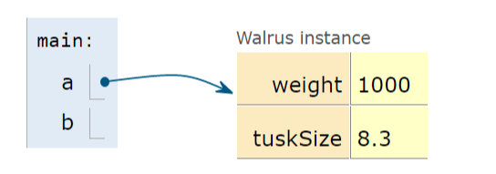
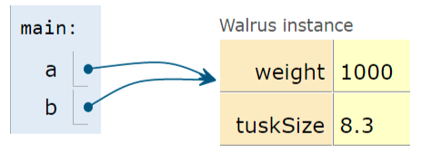

在C++中，数组等基本类型是按值传递参数：
**被调用过程接收其参数自身的副本。如果对某个参数复制引用，指向表示对象的数据被复制(重新生成一个关于该数据的副本，在引用后就会被清除)**


在Java中则是复制指针，引用后不会被消除，
在拷贝复制时，会复制一个指向数组或对象的变量的指针，故** 等式左边变量的指针指向等式右边的地址 **


注意以下代码：
```
{
  list=[1,2,3,4],
  x=list[0],
  list[0]=5,
  print(x),
}
```

在C++中，数组是基本类型，故打印出来的 x=1；

而Java是数据对象类型,打印出来的 x=5


>*布尔运算符*

1..x and y，如果x是false，则编译器会跳过对y的判断，直接输出有关false的表达式
'''python
print(3 and 4)
'''
编译器会从左到右判断，如果全部都是true，最后输出的是最右边的判断句，如上文输出的是4

2.2.x or y，
```
{
print(0 or 3)
print(1 or 3)
}
```
or的特性：当x求值为false的时候才会去判断表达式y

----------------------------------------------


>**2.2分析算法**

*归并排序*
```
{
  void merge_sort(int q[],int l,int r)
  {
    if(l>=r) return;

    int mid=l+r>>1;

    merge_sort(q,l,mid),merge_sort(q,mid+1,r)

    int k=0,i=l,j=mid+1;
    while(i<=mid && j <=r)
      {
        if(q[i] <=q[j])tmp[k++]=q[i++];
        else tmp[k++]=q[j++];
      }
    while(i<=mid) tmp[k++]=q[i++];
    while(j<=r) tmp[k++]=q[j++];

    for(i=1,j=0;i<=r;i++,j++)
      q[i]=tmp[j];
  }

}

```
----------------------------------------------

>**2.3设计算法**

>分治法

1.分治法思想：将原问题分解为几个规模较小但类似于原问题的子问题，递归地求解子问题
然后再合并这些子问题的解来建立原问题的解


2.步骤：(1)分解 (2)解决 (3)合并
  (1)分解：分解待排序的n个元素的序列成各具有n/2个元素的两个子序列
  
  (2)解决：使用归并排序递归地排序两个子序列
  
  (3)合并：合并两个已排序的子序列以产生已排序的答案

-----------------------------------------

# 第三章

>**3.1 渐进符号**

每个算法的时间复杂度可能各不相同，而在做项目，搞工程作业时，我们往往需要对代码的时间复杂度优化。
这就要我们清楚每个算法的时间复杂度Θ大致在哪个范围。
让我们来看看排序的算法效率图
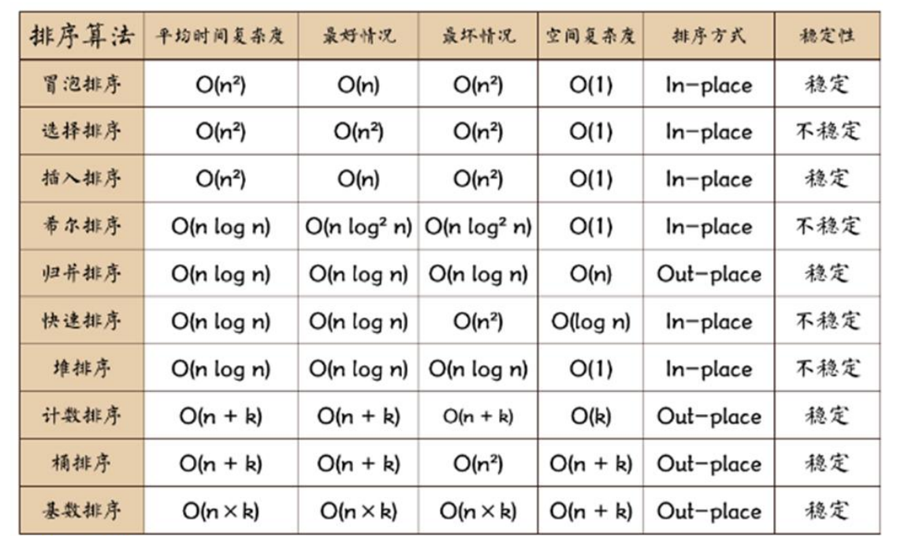

>*Θ* (定义在算法导论p25)

插入排序的最坏情况是an^2+bn+c，当n足够大的时候，插入排序的增长量级只看an^2
除去细节，就是Θ(n^2)-----所以插入排序的时间复杂度Θ(n^2)为an^2+bn+c

>*渐进符号*(p26)

**个人认为**渐进符号是一个算法的时间复杂度的上阙函数与下阙函数

>*=*

＝：**T(n)=Θ(n^2)**  ＝的意思是包含
  同时  因为Θ隐藏了细节,而T(n)被Θ(n^2)包含，所以会有 c1，c2 包含 R，使得 0<c1f(n))≤g(n)≤c2f(n)

>*上界和下界*

在上面：有0<c1f(n))≤g(n)≤c2f(n)，可知

1.O是上界：上阙函数 是f(n)的** 渐进上界 **  c2*f(n)

2.Ω是下界：下阙函数 是f(n)的** 渐进下界 **  c1*f(n)

3.o记号：表示非渐进紧确的上界，设其函数为p(x),在n趋近于∞时，p(x)/Ω(f(x))=∞

4.ω记号：表示非渐进紧确的下界，设其函数为q(x),在n趋近于∞时，q(x)/O(f(x))=0

>*关系性质* (把=看成包含于)
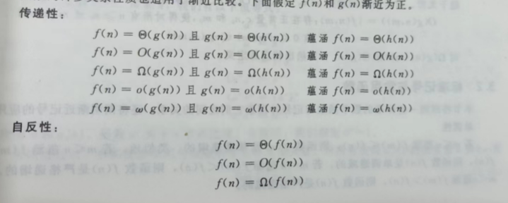

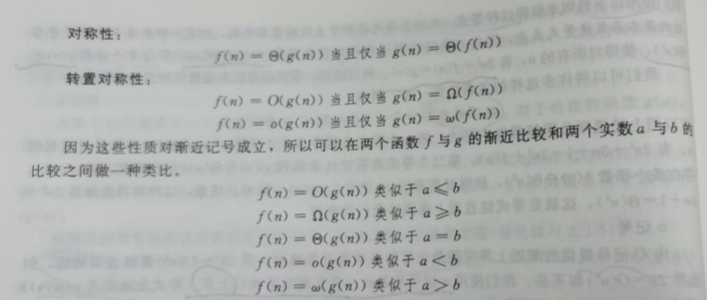

-------------------------------------------------------------
>**3.2 标准记号与常用函数**

>*向下取整与向上取整*

1.向下取整：[x]：表示小于或等于x的最小整数

2.向上取整：[x]：表示大于或等于x的最小整数

>*mod运算*

a mod n=a-n[a/n]

取值范围： 0≤a mod n<n     

>逆序对

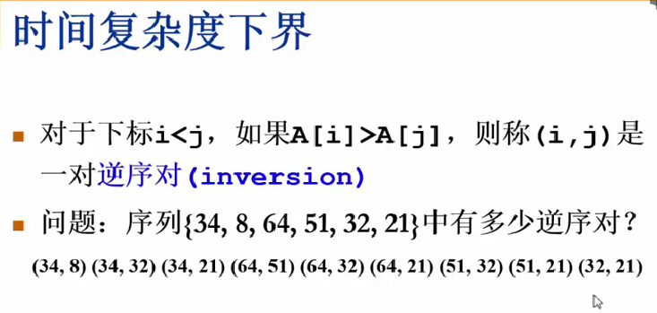

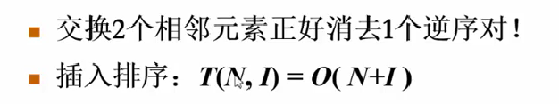

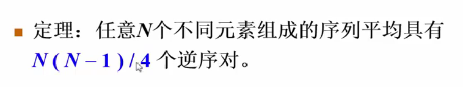

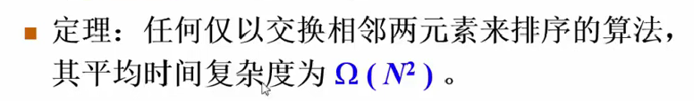

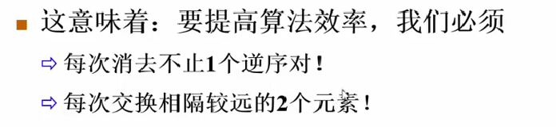


------------------------------


>课后作业

1.假设A[1...n]是一个有n个不同数的数组，若i<j且A[i]<A[j],
则对偶(i,j)称为A的一个逆序对：

  a.列出数组<2,3,8,6,1>的5个逆序对。

  b.由集合{1，2，...,n }中的元素构成的什么数组具有最多的逆序对。

  c.插入排序的运行时间与输入数组中逆序对的数量之间是什么关系？

  d.给出一个确定在n个元素的任何排列中逆序对数量的算法，最坏情况需要Θ(nlgn)时间。


2.可以使用二分查找法把插入排序的最坏情况总运行时间改进到Θ(nlgn)吗？