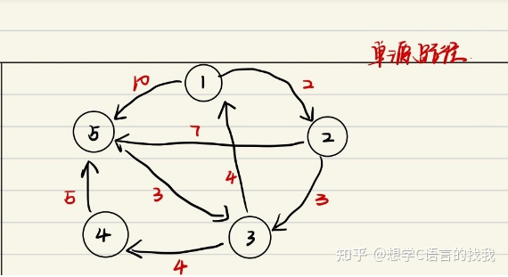
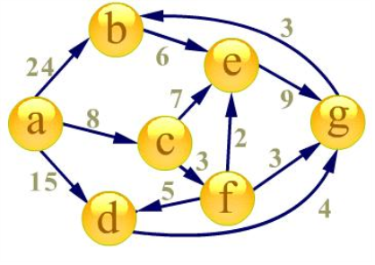
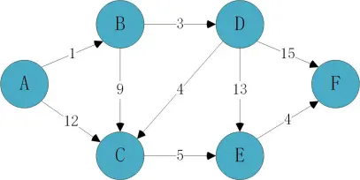

# 单源最短路径
问题:一个图中有n个点和m条边。边有权值,权值可正可负。边可能是有向的,也可能是无向的。
给定起点s和终点t,在所有能连接s和t的路径中,寻找边的权值之和最小的路径,这就是最短路径问题。


大体内容
1.Bellman-ford算法
2.SPFA(算法1的优化)
3.Dijkstra算法和它的一些简单优化

## 1.Bellman-Ford算法
1.简单介绍与直观证明正确性
Bellman算法是一个可以处理负权边和负权回路的算法,其主要思想主要是对所有边进行n-1次松弛操作。因为在一个有n个节点的图中,任意一条最短路径最长是n-1条边,第一轮松弛后,可以得到的是源点最多经过一条边到其他顶点的最短距离;同理,第i轮松弛,可以得到的是源点最多经过i条边到其他顶点的最短距离,固执行n-1次即可松弛即可。
2.如何工作(伪代码)
假设有m个节点,n条边。我们定义一个数组distance[n],存储的是第i个节点到源节点的最短路
```
for 1 to m,let distance[i]=∞
distance[s]=0        //初始化

for i in range(n-1):
    for edge_1 to edge_n:     
        distance[edge_to]=min(distance[edge_to],distance[edge_from]+edge)    //寻找最小路

for i in range(n-1):
    for edge_1 to edge_n:     
        if (distance[edge_from]+edge<distance[edge_to]):
            return false       //检查是否存在负环
return true
```
3.复杂度分析
很明显一共n-1次循环内嵌一个m条边的循环,复杂度为O(nm)
## 2.SPFA(Shortest path Fastest algorithm)

1.简单介绍
一般来说,Bellman算法不直接应用,因为实际上会有很多冗余的计算,SPFA便是一些优化的方法。其中最常见的就是引入队列了,算法思想为:初始时将源点加入队列,每次从队列中取出一个顶点元素,并将与他相邻的所有元素进行松弛,如果松弛成功,将该节点入列,直至队列为空。
2.算法原理
如果深入思考Bellman算法,我们就可以发现每轮计算其实只需要更新上一轮被更新的节点的邻边,那些没有变化的节点实际上他们的邻居并不需要改变,所以可以不用管。
3.代码实现
```
Initialize() //初始化

queue store;
store.push(s)
while (!store.empty())
{
    for each edge of front(store):
        relax()
        if (relax successfully) store.push(edge_to)
    store.pop() 
}
```
4.复杂度分析 (E条边,V个顶点)
一般来说,SPFA可以在O(kE)的条件下实现单源最短路径,k一般是1或2,但是一些特殊的图会导致SPFA的k趋近于V,即节点个数,这导致它的最差复杂度达到O(EV),很不稳定,所以Dijkstra算法还是很要必要介绍的,此外我们可以通过一个节点是否入队列V次来判断是否有负权环出现
*5.再优化
SLF策略:如果加入的节点是j,队首元素是i,如果dist[i]>dist[j],将j插入到队头

LLL策略:设队首元素为i,队列中所有dist值的平均值为x,若dist[i]>x,则将i插入到队尾,查找下一元素,直到找到某一i使得dist[i]<=x,则将i出队列进行松弛操作
## 3.Dijkstra算法
1.简单介绍
是一个使用了贪心思想的单源最短路径算法,但是不允许路径有负权出现。算法实现是从源点出发,使用BFS拓展它的邻居节点,对其松弛后,放入一个集合A中,将源点记为访问,之后不断循环,每次循环选取集合中未访问的A中distance中最小的那个,Relax它指向的邻居节点并放入A中,最后将这个节点标记为访问。当集合A中所有元素都被访问后,单源最短路径生成完毕
2.算法原理
对于一个权值均为正数的有向图来说,我们可以从源点出发,可能会有很多种情况,但是我们知道当前最小的distance[i]的就是最短路径的节点,因为要从源点通过另一种方式到达这个最小节点一定会通过大于到达这个源点的路径。其他也同理

3.算法实现
首先我们可以使用最小堆来完成这个集合A,一开始初始化,以dist[i]为堆的比较值,如果标记访问的话,直接让他出堆。
```
distance[n]=∞   //初始化
distance[s]=0   //源节点记为0
visit[n]=0      //记录是否被访问过
minheap         //使用最小堆存储
minheap.push(s)
while (minheap.size()):
    now_V=minheap.top()   minheap.pop()
    if (visit[now_V]) continue
    visit[now_V]=1
    for each_edge in now_V:
        relax()
        minheap.push(edge_to)
```
4.复杂度分析
如果不使用堆优化的话,每次寻找最小的需要O(V)的时间,寻找到了对该节点进行松弛的复杂度O(V),故O(V²)。如果使用堆优化,插入时和出堆时的复杂度均为O(logV),替换掉寻找最小的时间,故时间复杂度为O(VlogV)


