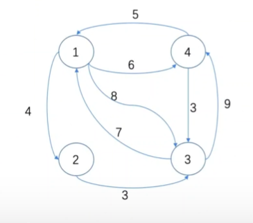
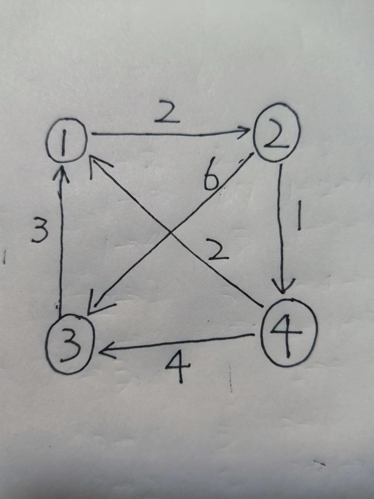
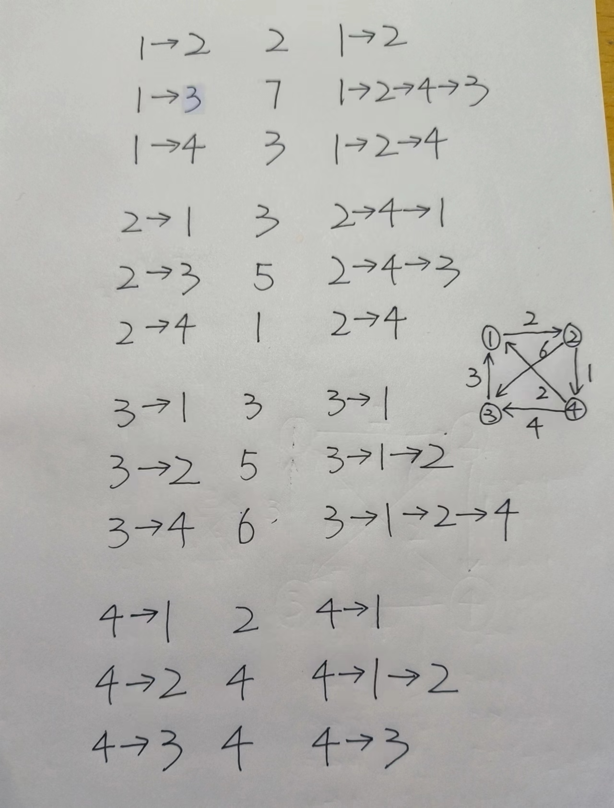
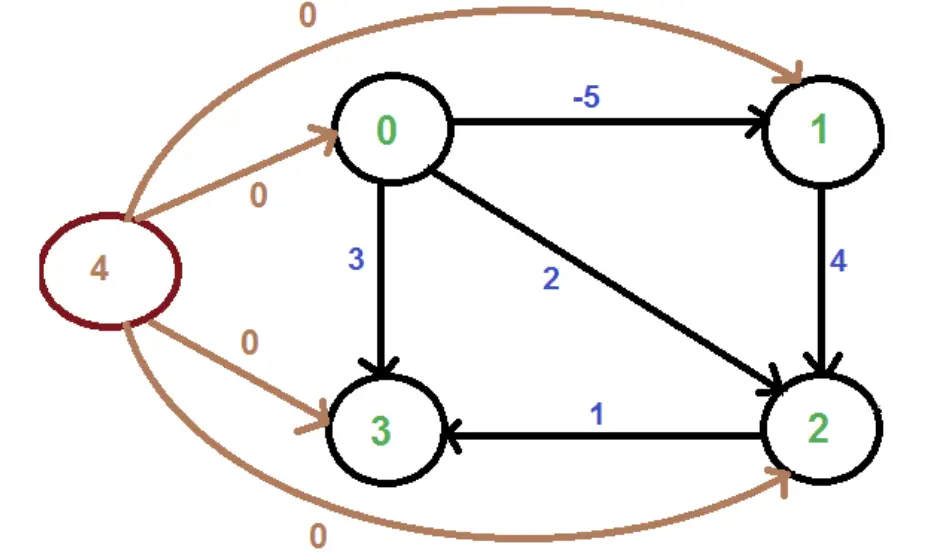

# 多源最短路径
多源最短路径是一个可以求出各个点到各个点之间最短权值的算法  

### 首先我们尝试使用单源最短路算法来解决问题:
我们使用V次单元最短路径来解决所有结点对之间的最短路径问题: 
现在假设有V个顶点,E条边 (Vertex,Edges)  

1.如果我们使用Bellman算法来解决多源最短路问题,对于一次Bellman算法,它的开销是O(EV),执行V次即为O(EV²),当图是一个稠密图的时候,E=V²,复杂度到达惊人的O(V<sup>4</sup>)。

2.如果我们使用Dijkstra算法来解决的时候,对于一次Dijkstra算法,它的开销是O(E+V²),使用二叉堆来优化,复杂度为O((V+E)logV)。使用斐波那契堆来进行优化,此时复杂度为O(E+VlogV),当图为稠密图时并且执行V次,复杂度来到O(V<sup>3</sup>+V<sup>2</sup>logV)=O(V<sup>3</sup>),虽然是个三次方的运行效率,但是代码复杂,并且只能在没有负权边的时候使用。

### Floyd算法
1.算法流程:
(1)初始化
(2)每次从1到n选取一个节点加入,尝试所有路径是否可以通过当前选中节点达到更小路径
```Python
d[n][n];   //一开始存放节点距离,如果节点之间不存在路径使用∞表示,如果i=j时d[i][j]=0
for k in range(n):
    for i in range(n):
        for j in range(n):
            d[i][j]=min(d[i][k]+d[k][j],d[i][j])
```
  
### Floyd算法的正确性
我们可以将d[i][j]=min(d[i][k]+d[k][j],d[i][j])看作松弛操作,添加节点k进行松弛后,可以得到任意两节点u,v和节点k对于u->k->v的最短路径(如果存在的话)

  

### Johnson算法
Johnson算法是一个适用于稀疏图的多源最短路径算法,前面我们提到Dijkstra算法需要非负的缺点,但是通过斐波那契堆来进行优化Dijkstra最后的复杂度是O(EV+V²logV),当图为稀疏图时,Floyd算法的复杂度仍为O(V<sup>3</sup>),但此时Dijkstra可以做到O(V²logV)的复杂度,JohnSon算法通过使用Bellman算法来改变原图中的权值,使得图能做到如下两个特点:
1.如果原图中有负权环出现时不会陷入死循环并且能发现
2.图中没有负权值出现
3.原图中的最短路径不会改变,对于任意i,j两点的任意路径权值是一样的

### Johnson算法的过程
首先我们假设出一个虚节点image,让这个虚节点到各个节点的路径都为0,然后对这个虚节点进行一次Bellman算法,得到一个单源最短路径数组h[n](到n个节点的最短距离)
对于图中的所有边E{u,v,weight},我们将其改变为{u,v,weight+h[u]-h[v]}
最后进行n次Dijkstra算法(通过斐波那契堆进行优化的版本)即可
```
D                      //图矩阵
h[n]                   //n个点到虚节点的最短距离
Bellman-Ford(image)    //计算虚节点到n个点的距离
for i in range(n):
    for j in range(n):
        if edge{i,j} exist:
            weight(i,j)=weight(i,j)+h[i]-h[j]
for i in range(n):
    Dijkstra(i)
for each-edge{u,v}:
    weight(u,v)+=h[v]-h[u]
```
  
  
### Johnson算法的正确性
首先证明改变权值的三个特性: 

1.如果原图中有负权环出现时不会陷入死循环并且能发现: 

如果原图中有负权环,通过对虚拟节点进行Bellman算法可以发现 

2.图中没有负权值出现:
 
假设图中有负权值出现,即weight_change<u,v>=weight<u,v>+d[u]-d[v]<0
即在进行完Bellman算法后,仍然存在weight<u,v>
即d[v]>weight<u,v>+d[u],这条边很明显可以进行松弛,但是Bellman算法却没有检测到,明显不成立,故得证

3.原图中的相对最短路径不会改变: 
对于某一原最短路径u->x1->x2->v
原路径权值: weight<u,x1>+weight<x1,x2>+weight<x2,v>
更新后: weight<u,x1>+h[u]-h[x1]+weight<x1,x2>+h[x1]-h[x2]+weight<x2,v>+h[x2]-h[v],等于 weight<u,x1>+weight<x1,x2>+weight<x2,v>+h[u]-h[v]


